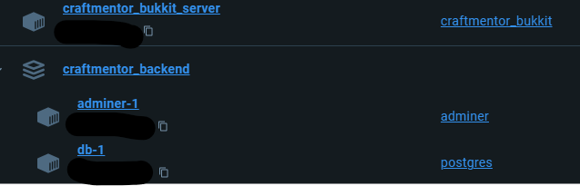
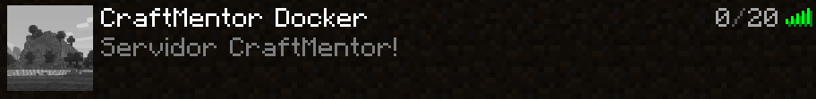
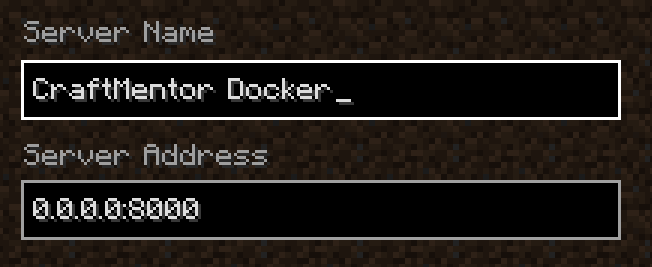
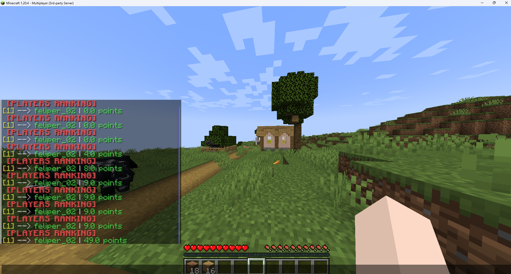

<div align='center'>
    
</div>

## Estrutura de pastas

[CraftMentor/](https://github.com/TRABALHOS-FACULDADE/craftmentor_sistemas_distribuidos/tree/main/CraftMentor) | Aqui estão os arquivos do projeto em `Kotlin` referente ao Plugin desenvolvido com a biblioteca `Spigot 1.20.4` (Bukkit)

[CraftMentorBukkit/](https://github.com/TRABALHOS-FACULDADE/craftmentor_sistemas_distribuidos/tree/main/CraftMentorBukkit) | Aqui estão os arquivos de configuração do servidor Bukkit

[craftmentor_backend/](https://github.com/TRABALHOS-FACULDADE/craftmentor_sistemas_distribuidos/tree/main/craftmentor_backend) | Aqui estão os arquivos do backend feito em `Dart`

## Instalação e configuração

### Requisitos

- Docker
- [Dart 3.4.0](https://dart.dev)
- Java | JRE 1.8.0
- [Minecraft 1.20.4](https://www.minecraft.net/pt-br)

### Instalação

1. Clone o repositório

```bash
git clone https://github.com/TRABALHOS-FACULDADE/craftmentor_sistemas_distribuidos.git
```

2. Crie os containers para o PostgreSQL e o Adminer

```bash
docker build ./craftmentor_backend/
```

3. Execute o servidor Dart Shelf para se comunicar com o PostgreSQL

```bash
dart ./craftmentor_backend/bin/craftmentor_backend.dart
```

4. Crie o container para o servidor Minecraft Bukkit

```bash
docker build -t craftmentor_bukkit ./CraftMentorBukkit/
```

5. Execute o container do Bukkit e configure-o para se comunicar com o localhost

```bash
docker run --name craftmentor_bukkit_server --add-host host.docker.internal:host-gateway -it -p 8000:8000 craftmentor_bukkit
```

> Forma alternativa para as etapas **4** e **5**:

```bash
./CraftMentorBukkit/start.bat ### Ou, caso esteja usando S.O Linux:

### Renomeie o arquivo para start.sh e execute:

bash ./CraftMentorBukkit/start.sh
```

6. No Minecraft (versão 1.20.4), conecte-se ao servidor através do endereço

```
0.0.0.0:8000
```

## Rotas

[**[GET]**](0.0.0.0:8001/players) `0.0.0.0:8001/players` | Lista os jogadores do servidor, permitindo visualizar a pontuação de cada.

[**[GET]**](0.0.0.0:8001/player-exists/teste) `0.0.0.0:8001/player-exists/<player_name>` | Verifica se um jogador já está cadastrado no servidor.

[**[POST]**](0.0.0.0:8001/players/) `0.0.0.0:8001/players` | Cadastra um novo jogador no servidor. | Recebe um _body_ `{"id": <uuid>, "name": <player_name>}`

[**[PATCH]**](0.0.0.0:8001/player/teste) `0.0.0.0:8001/player/<name>` | Atualiza a pontuação de um jogador. | Recebe um _body_ `{"points": <valor_em_double>}`

## O projeto

Consiste em um sistema que monitora o inventário dos jogadores dentro de um servidor de Minecrat (**Bukkit hospedado em um container Docker**) e, após <ins>10 segundos</ins>, um cálculo é feito para atualizar a pontuação de cada jogador com base nos tipos de itens coletados. Os blocos e suas respectivas pontuações podem ser visualizados [**aqui**](https://github.com/TRABALHOS-FACULDADE/craftmentor_sistemas_distribuidos/blob/main/CraftMentor/src/main/java/dev/feliperf/craftmentor/Presenter/Controllers/BlockRankingController.kt).

### Docker

No Docker, estão os seguintes containers:

- Servidor Bukkit (porta 8000)
- PostgreSQL (porta 5435)
- Adminer (porta 8082)



O Adminer é uma interface que permite interagir com o banco de dados do PostgreSQL e criar/deletar/alterar tabelas dentro dele.

### Backend Dart

Na porta 8001, estará rodando o backend em Dart na máquina local. Em [**seu código**](https://github.com/TRABALHOS-FACULDADE/craftmentor_sistemas_distribuidos/blob/main/craftmentor_backend/bin/craftmentor_backend.dart), será estabelecida a comunicação com o banco de dados do PostgreSQL (que estará rodando no container Docker).

### Servidor Minecraft - Bukkit




